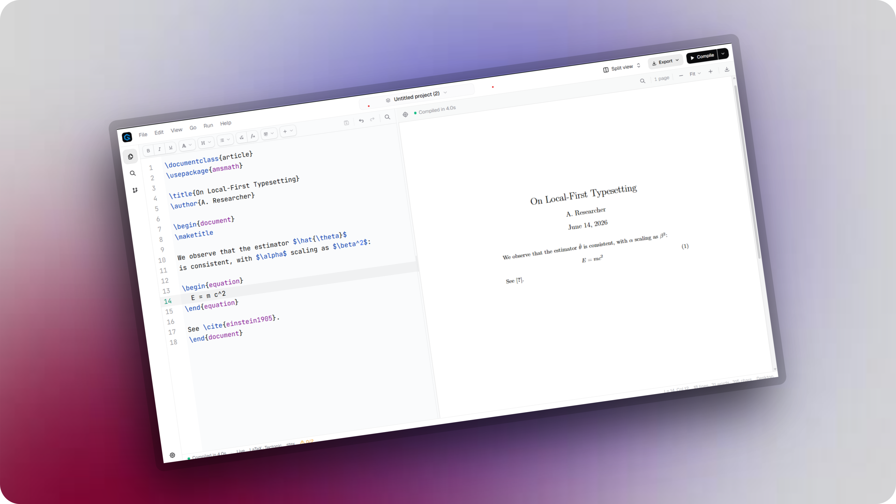

# GlyphTeX

### The LaTeX editor Overleaf should have been.

Write papers, proofs, and theses in real LaTeX, on a tool that runs on your own
computer. Your files stay on your disk, your work compiles without a server, and
nothing has to leave your machine.

**Free in your browser · No account · Open source**

---

> [!NOTE]
> **The browser workspace is where GlyphTeX is being built right now.** A desktop
> app exists, but it is an unmaintained prototype: the builds on the Releases page
> are well behind the current editor and are not supported. Treat them as an
> archive, not a download. Desktop work resumes once the editor settles.

## What it is

GlyphTeX is a place to write LaTeX that keeps your work where you can see it: on
your computer.

**In your browser.** Open the page, start typing, and watch the document render
beside you. No account, nothing to install. The LaTeX engine is compiled to
WebAssembly and runs in the tab, so your files never leave the machine — they are
stored in the browser, not on a server.

**On the desktop.** A Tauri shell that puts the editor, the compiler, and your
project folder directly on disk, with a built-in Git client. Currently paused;
see the note above.

It is built for the people who spend weeks inside one long document full of math:
researchers, PhD students, and anyone writing a thesis, a proof, or a paper.

## Why we built it

Overleaf did something useful. It took LaTeX, which used to mean a heavy install
and a wall of package errors, and put it one click away. A lot of people wrote
their first paper because of that.

The browser was also the catch. Your project lives on someone else's servers. A
long chapter starts to lag because every keystroke makes a round trip. Let a
build run too long on the free plan and you get a timeout instead of a PDF. Want
version history, a few more collaborators, or Git, and you are reading a pricing
page. None of that has much to do with writing LaTeX. It has to do with running a
cloud.

GlyphTeX starts from the other side. The editor and the compiler run on your
computer. Opening a project means reading a folder. Saving means writing a file.
There is no server in the loop, so there is nothing to time out, nothing to
subscribe to, and nothing of yours sitting on a machine you cannot see.

## What you can do with it

- **Write real LaTeX.** Full math, figures, BibTeX, and the packages a journal
  template or thesis class actually needs. What you write is standard `.tex`
  that any LaTeX setup can read, and the PDF you get is the PDF your reviewer
  gets.
- **Compile on your own machine.** GlyphTeX ships its own LaTeX engine
  ([Tectonic](https://tectonic-typesetting.github.io/)) — as WebAssembly in the
  browser, natively on the desktop. No multi gigabyte TeX install to fight, no
  shared build queue, no timeout the night before a deadline. The preview keeps
  up while you type.
- **See the page as you write.** Source on the left, the rendered document on the
  right, updating as you go. Double click a spot in the PDF to jump to the line
  that produced it, and jump the other way too.
- **Open a folder and start.** A project is a normal directory of `.tex` and
  `.bib` files. Open it, edit it, drag files between folders, and back it up the
  way you back up everything else.
- **Use Git without paying for it.** The desktop shell has a built in Git client:
  stage and commit, see a side by side diff, browse history, clone a repository,
  and push, pull, or sync with your own remote. Real version control, no
  subscription tier. (Desktop only, and currently paused.)
- **Read your own errors.** When a build fails, the problems panel lists the
  errors with line numbers you can click. The last good PDF stays on screen
  instead of going blank.
- **Stay private.** Unpublished results, a grant draft, a thesis under embargo:
  none of it is uploaded, indexed, or fed to a model. It sits on your disk and
  nowhere else.

## Where your data goes

The heavy and private work stays local. You reach the cloud only through accounts
you already own.

- **Compiling is local.** The engine runs on your computer. There is no build
  sitting on our servers and nothing to time out.
- **History is yours.** Commits live in your own Git repository, on your disk and
  on the remote you choose.
- **Sharing is opt in.** Nothing leaves your machine unless you send it. We never
  hold a copy of work you did not choose to share.

## Getting started

**Open the browser workspace.** No download, no account, nothing to install. That
is the whole of getting started, and it is the version worth your time.

The [Releases](https://github.com/kanakkholwal/glyphtex/releases) page still has
old desktop builds. They are prototypes from an earlier stage of the project, they
receive no updates, and they are missing most of what has landed since. Only reach
for one if you specifically want to see where the desktop shell got to.

Already have Overleaf projects? They are plain LaTeX underneath. Download the
project folder as a `.zip` and drop it into the workspace.

## On the roadmap

These are planned, not shipped, and we would rather say so plainly.

- **A desktop app worth releasing.** The Tauri shell is real but out of date. It
  gets picked back up, and properly packaged for macOS, Windows, and Linux, once
  the browser editor stops moving underneath it.
- **Bring your own AI key.** Connect an API key from a provider you trust and use
  it to rephrase a paragraph, draft an equation, or decode a compiler error. The
  request goes from the app straight to your provider, on your own account and
  billing.
- **Dropbox and Google Drive sync.** Keep a project in cloud storage you already
  pay for and pick it up on another machine, under your own account.
- **Share a project.** Hand a project to a collaborator from the desktop app,
  stored only while it is shared and only under your account.

## Contributing

GlyphTeX is open source, and bug reports, ideas, and pull requests are all welcome.
See **[CONTRIBUTING.md](CONTRIBUTING.md)** for how to set the project up on your
machine and submit a change.

## License

GlyphTeX is licensed under the **[GNU General Public License v3.0](LICENSE)**. You
are free to use, study, share, and modify it. If you distribute a modified
version, it has to stay under the same license.
