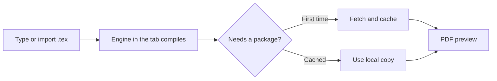

:::takeaways
- LaTeX compiles fully inside a browser tab, no install and no account.
- The engine caches after the first compile, so later compiles work offline.
- You can start from a blank document or import an existing project as a ZIP or folder.
- The output is a standard PDF, identical to what a local install produces.
:::

For years, compiling LaTeX meant installing a distribution measured in gigabytes. That step alone stopped a lot of people. It is no longer necessary. This tutorial shows how to compile a LaTeX document to PDF in your browser, start to finish, in a few minutes.

## How it works

GlyphTeX compiles the [Tectonic engine to WebAssembly](/engine), so the actual LaTeX compiler runs in your browser tab. There is no server doing the work and no upload. Packages are fetched the first time a document needs them, then cached for next time.



## Step 1: open the workspace

Go to the [workspace](/workspace). It opens straight into an editor, no sign-up screen.

## Step 2: start a document

Paste this minimal document into the editor, or start from a template:

```latex
\documentclass{article}
\title{My first browser compile}
\author{Your name}
\begin{document}
\maketitle

Hello from a LaTeX document that compiled in a browser tab.

\end{document}
```

## Step 3: compile

Press the compile action (or the keyboard shortcut shown in the editor). The first compile downloads the engine, roughly 15 MB, and caches it. The PDF appears in the preview pane.

:::callout{type=note title="First compile is the slow one"}
The engine and any packages download once and cache. Every compile after that is fast and works with no network.
:::

## Step 4: import an existing project

Already have a project? Two ways to bring it in:

- **ZIP:** drag a project ZIP (including one exported from Overleaf) onto the workspace.
- **Folder:** in the [desktop app](/download), open the folder directly.

If your main file is not `main.tex`, set the main file so the compiler knows the entry point.

:::callout{type=tip title="Coming from Overleaf"}
Use **Menu then Download** in Overleaf to get the ZIP, then drop it into the workspace. No reformatting needed.
:::

## Step 5: keep working offline

Once the engine is cached, disconnect and keep compiling. The document, the compiler, and the cached packages are all on your side. Nothing breaks when the network does.

::stats{items="~15 MB :: Engine, cached once | 0 :: Accounts | Offline :: After first compile" source="GlyphTeX browser workspace."}

## Common first-compile questions

- **Nothing happens on compile.** Check that a main file is set and that the document has `\begin{document}` and `\end{document}`.
- **A package seems missing.** The first use of a package fetches it; give it a moment on the first compile.
- **An error stops the build.** Read the first error, not the last. See [Fix: Undefined control sequence](/docs/fixing-errors/undefined-control-sequence) and [Fix: Missing \$ inserted](/docs/fixing-errors/missing-dollar-inserted).

::cta{title="Compile your first document now" body="Open the workspace and paste the example above. You will have a PDF in under a minute." label="Open the workspace" href="/workspace" from="compile-latex-in-browser"}

## Next steps

- New to LaTeX structure? Read [Compile your first document](/docs/getting-started/first-document).
- Writing something long? See [Structure a thesis in LaTeX](/docs/writing/thesis-structure).
- Want the why behind browser compilation? Read [Why your LaTeX should compile on your own machine](/blog/why-local-first-latex).
