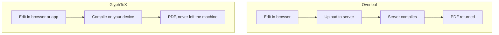

:::takeaways
- GlyphTeX compiles on your device; Overleaf compiles on its servers.
- GlyphTeX is free with no tiers; Overleaf gates compile time, history, and collaborators behind paid plans.
- Overleaf wins on real-time co-editing. GlyphTeX wins on privacy, offline use, and cost.
- Both edit standard LaTeX, so switching either way is a file copy.
:::

Both tools write LaTeX and produce a PDF. The difference is architecture, and that choice drives everything else: where your files live, whether you can work offline, and what you pay.

This is a factual comparison. Everything below is verifiable, and where Overleaf is the better fit, it says so.

## The core difference

Overleaf is a hosted service. Your project uploads to its servers, compiles there, and the PDF comes back. GlyphTeX compiles where you are: in the browser tab through a [WebAssembly engine](/engine), or in a [desktop app](/download).

## Feature comparison

| | GlyphTeX | Overleaf |
| --- | --- | --- |
| Where it compiles | Your device | Overleaf servers |
| Works offline | Yes | No |
| Account required | No | Yes |
| Price | Free (GPL-3.0) | Free tier, then paid |
| Compile time limit | None (your hardware) | Limited on free plan |
| Version history | Git, included | Paid plans |
| Real-time co-editing | No | Yes |
| Your files leave your device | No | Yes, to compile |
| Open source | Yes | Core is open, service is not |

## Where Overleaf is better

Two honest points.

- **Real-time collaboration.** If several authors need to type in the same document at the same moment and see each other's cursors, Overleaf does this well and GlyphTeX does not replicate it.
- **Zero-thought sharing.** Sending a link to a live project is frictionless. Local-first collaboration goes through Git or shared files, which is a different habit.

:::callout{type=note title="If live co-editing is non-negotiable"}
Overleaf remains the stronger choice for a team drafting the same section simultaneously. Pick the tool that matches how you actually work.
:::

## Where GlyphTeX is better

- **Privacy.** Unpublished results, embargoed theses, and papers under review never leave your machine. There is no server copy to breach or subpoena.
- **Offline.** Compiles on a plane, in a basement lab, anywhere. No network needed once the engine is cached.
- **Cost.** Free, with no compile-time cap. Long documents that would time out on Overleaf's free plan compile as fast as your hardware allows.
- **No lock-in.** Projects are plain folders of plain files, readable by any LaTeX tool.

::stats{items="Free :: GlyphTeX, all features | No cap :: Compile time | 0 :: Files uploaded" source="GlyphTeX is GPL-3.0 with no paid tier."}

## Compile speed

Overleaf's speed depends on its server load and your plan; the free tier caps compile time and can queue during busy periods. GlyphTeX's speed depends on your CPU. On a modern laptop, a typical article compiles in a few seconds, and there is no queue because there is no shared server.

## Switching either direction

Because both use standard LaTeX, moving is a file operation:

- **From Overleaf:** download the project ZIP, open the folder in GlyphTeX.
- **To Overleaf:** upload the same files. Nothing in GlyphTeX changes your source.

There is no export format, no conversion, no lock-in in either direction.

::cta{title="Try it against your own project" body="Download your Overleaf ZIP and open it in the browser workspace. Compare the result yourself." label="Open the workspace" href="/workspace" from="glyphtex-vs-overleaf"}

## The short version

Choose Overleaf if live co-editing is central to how you write. Choose GlyphTeX if you want your files to stay yours, work offline, and pay nothing. For most solo academic writing, the local-first trade-offs land in your favour.

Related reading: [Overleaf alternatives in 2026](/blog/overleaf-alternatives) and [Is Overleaf free?](/blog/is-overleaf-free).
