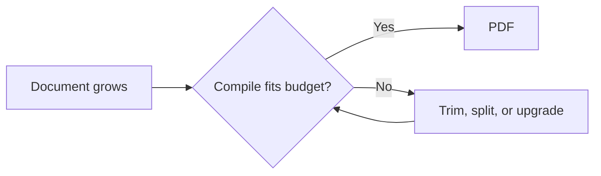

:::takeaways
- Yes, Overleaf has a free plan, and for short documents it is enough.
- The free plan limits compile time per run, collaborators per project, and full history.
- Long theses and image-heavy papers are where the compile-time cap bites.
- Compiling on your own device removes every one of these limits, for free.
:::

Overleaf is free to start, and for a short paper with one author it may be all you need. The limits appear as your documents grow: longer compiles, more collaborators, and the version history you want when a deadline is near. This is a plain accounting of what the free plan includes, what it caps, and the free alternative with no caps.

## What the free plan includes

The free plan lets you write and compile LaTeX in the browser, use templates, and share a project with a limited number of collaborators. For a coursework submission or a short article, that covers the job.

## What it limits

Three limits matter in practice.

### Compile-time limit

Each compile has a time budget. Short documents finish comfortably. A long thesis, a document with many high-resolution figures, or heavy packages can exceed it and fail to produce a PDF until you trim, precompile, or upgrade.

:::callout{type=warn title="Where this hurts most"}
Final thesis week, when the document is longest and full of figures, is exactly when the free compile-time cap is most likely to bite.
:::

### Collaborators per project

Free projects allow a small, fixed number of collaborators. Larger author teams need a paid plan.

### Version history

Full, dated version history and the ability to roll back to any point are paid features. The free plan's history is limited.

## The cost of the workaround

The common free-plan workarounds all cost you something other than money:

- **Trimming the document** to fit the compile budget wastes time near a deadline.
- **Splitting into smaller files** to compile separately adds coordination overhead.
- **Precompiling the preamble** helps, but it is a workaround for a limit you did not choose.

## Compile free with no limits: your own device

The limits above exist because compiling costs the host money on shared servers. Compile on your own device and the economics, and the caps, disappear.

- **In the browser:** GlyphTeX runs the compiler in your tab through a [WebAssembly engine](/engine). No account, no upload, and no compile-time cap. Your hardware is the only limit.
- **On the desktop:** a one-time install of TeX Live or MiKTeX, or the [GlyphTeX desktop app](/download), compiles natively and offline.

::stats{items="Free :: Every feature | No cap :: Compile time | Unlimited :: Collaborators via Git" source="Local compilation removes the server-cost limits that drive paid tiers."}

Version history comes free too, through Git, which records every change and lets you roll back to any commit.

::cta{title="Compile a long document, free" body="Open the browser workspace and compile your full thesis with no time limit. No account needed." label="Open the workspace" href="/workspace" from="is-overleaf-free"}

## So, is Overleaf free?

Free to start, yes. Free without limits, no. If those limits have not slowed you down, the free plan is fine. When they do, usually on the longest, most important documents, compiling on your own device gives you every feature with no cap and no cost.

Related: [Overleaf alternatives in 2026](/blog/overleaf-alternatives) and [How to write LaTeX without Overleaf](/blog/latex-without-overleaf).
