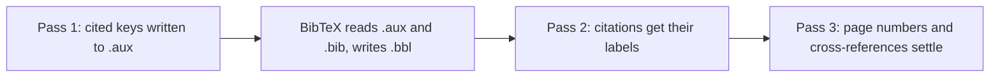

:::takeaways
- `[?]` means LaTeX found no bibliography entry for that key. `??` usually means an unresolved `\ref`, not a citation.
- Work through five causes in order: a wrong key, a `.bib` file that was not found, a bibliography that never built, biblatex asking for Biber, and stale auxiliary files.
- GlyphTeX reruns passes and runs BibTeX itself whenever your document asks for it.
- In the browser, biblatex needs one change: `backend=bibtex`.
:::

You compile, the PDF looks right, and every citation reads `[?]`. Or the text is fine but "see Section ??" appears in the middle of a paragraph. Both come from the same design decision in LaTeX: references are resolved late, across more than one pass, and anything that breaks that chain leaves a placeholder behind.

This guide explains the chain, then walks through each way it breaks and how to fix it.

## What [?] and ?? actually mean

On the first pass, `\cite{shannon1948}` does not look anything up. It writes the key into the `.aux` file and moves on. A separate tool (BibTeX or Biber) reads those keys and your `.bib` file and writes a `.bbl` file of formatted entries. The next pass reads the `.bbl`, and only then does the citation get its number or author-year label.



If a key still has no entry when LaTeX reads the `.bbl`, it prints `[?]` and logs a warning such as `Citation 'shannon1948' on page 3 undefined`. biblatex prints the key itself in bold instead of `[?]`, but the cause is the same.

`??` is the same mechanism for `\ref`, `\eqref` and `\pageref`. The label has not been seen, usually because it is misspelt, missing, or the document has not had enough passes. Check the `\label` first; the rest of this guide is about citations.

## What GlyphTeX does for you

The GlyphTeX engine runs the whole chain itself. After a pass, it looks in the `.aux` file for `\bibdata`, the line that names your bibliography. Classic `\bibliography{...}` writes it, and so does biblatex when it uses the BibTeX backend. If it is there, the engine runs BibTeX once, inside the same WebAssembly module, then repeats passes while the intermediate files keep changing. You never sequence latex, bibtex, latex, latex by hand. The [engine page](/engine) shows the full pipeline.

What it cannot do is run Biber. biblatex uses Biber by default, and in that mode it writes a `.bcf` file for Biber and no `\bibdata` at all, so there is nothing BibTeX can serve. The workspace detects this case and shows a "Bibliography not generated" notice with the one line to change, rather than quietly dropping your references.

## Cause 1: the key is missing or misspelt

Keys are case-sensitive and must match exactly. `Shannon1948`, `shannon1984` and `shannon1948` are three different keys. Find the undefined key in the warning, which the Problems panel lists with the line it came from, then compare it with the `.bib` entry. BibTeX's own log says the same thing in its words: `I didn't find a database entry for "shannon1984"`.

A broken entry has the same effect. A missing comma between fields or an unclosed brace can make BibTeX skip that entry, and every citation of it falls back to `[?]`.

The surest fix is to stop typing keys. In GlyphTeX, typing inside `\cite{`, `\parencite{`, `\textcite{`, `\autocite{` and the other cite commands suggests keys from your project's `.bib` files, with each entry's title and author, so you pick the right one instead of retyping it.

## Cause 2: the .bib file is not found

The two systems name the file differently, and mixing them up is common:

```latex
% Classic BibTeX: no extension
\bibliography{references}

% biblatex: with the extension
\addbibresource{references.bib}
```

If the file sits in a subfolder, include the path (`\bibliography{bib/references}`), and match the file name exactly, including capital letters. When BibTeX cannot find the file, its log says `I couldn't open database file references.bib`. The general version of this problem is covered in [Fix: File not found](/docs/fixing-errors/file-not-found).

## Cause 3: the bibliography never built

Classic BibTeX needs two commands, and missing either one stops the bibliography:

```latex
\bibliographystyle{plain}
...
\bibliography{references}
```

Without `\bibliography`, no `\bibdata` is written and BibTeX has nothing to do. Without `\bibliographystyle`, BibTeX stops with `I found no \bibstyle command`. In both cases there is no `.bbl`, so every citation is `[?]`.

On a manual toolchain, the other way to land here is forgetting a step: you must compile, run bibtex, then compile twice more. In GlyphTeX that sequence runs on every compile, so if citations are still unresolved, the cause is one of the others on this page. The full setup for both systems is in [LaTeX bibliographies with BibTeX and biblatex](/docs/writing/bibliographies).

## Cause 4: biblatex set to Biber in the browser

This is the browser-specific one. Biber is a Perl program with no WebAssembly build, so it cannot run in a tab. The fix is one line in the preamble:

```latex
% Before: needs Biber
\usepackage[backend=biber, style=authoryear]{biblatex}

% After: builds with BibTeX inside the engine
\usepackage[backend=bibtex, style=authoryear]{biblatex}
```

A plain `\usepackage{biblatex}` with no options also means Biber, because that is the default, so it needs the option added too. Everything else stays as it is: `\addbibresource`, `\autocite`, `\printbibliography` and your chosen style.

:::callout{type=warn title="What the BibTeX backend gives up"}
biblatex supports fewer features under BibTeX than under Biber: full Unicode sorting and source maps are among the Biber-only ones. If your document depends on them, compile with a local TeX Live or MiKTeX install, which ships Biber. The [desktop app](/download) can drive that install through its System TeX engine, but it is an early prototype.
:::

## Cause 5: stale auxiliary files

LaTeX trusts the `.aux` and `.bbl` files from the previous run. If a compile was cut short, or you changed keys, backends or bibliography files in a big way, the leftovers can describe a document that no longer exists. The signs are citations that stay wrong after you fixed them, or errors that point into an `.aux` or `.bbl` file. On a manual toolchain, delete the `.aux`, `.bbl`, `.bcf` and `.blg` files and compile again.

In GlyphTeX this rarely bites:

- The desktop app compiles into a fresh temporary folder each time, so nothing from an earlier build carries over.
- The browser engine keeps one document's auxiliary files in memory between compiles, so references settle in fewer passes. It drops them when you open a different document, and reloading the tab starts the engine fresh.
- Importing a project skips `.aux`, `.bbl`, `.blg` and `.log` files, so the build leftovers in an Overleaf ZIP never reach the engine.

## A quick checklist

1. Read the warning and note the exact key.
2. Check that the key matches the `.bib` entry, letter for letter.
3. Check the file name: no extension in `\bibliography`, extension in `\addbibresource`.
4. Classic BibTeX: are both `\bibliographystyle` and `\bibliography` present?
5. biblatex in the browser: is `backend=bibtex` set?
6. Still stuck: reload the tab, or delete the auxiliary files on a manual setup.

::cta{title="Let the engine run the passes" body="Open the browser workspace, drop in your .tex and .bib files, and compile. BibTeX runs automatically, offline." label="Open the workspace" href="/workspace" from="latex-citations-question-marks"}

## Related

- Setting up citations from scratch: [LaTeX bibliographies with BibTeX and biblatex](/docs/writing/bibliographies).
- Other errors in plain language: [the error guide index](/errors).
- How a browser compile runs, step by step: [the GlyphTeX engine](/engine).
