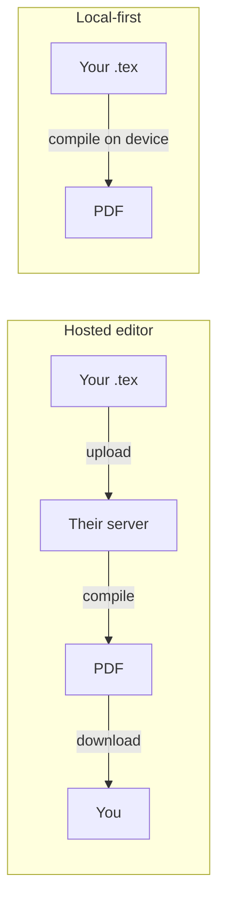

:::takeaways
- Overleaf is a hosted editor: your source lives on their servers and compiles there.
- You can get the same result locally, with the files staying on your machine.
- Two low-friction routes: a browser engine (no install) or a desktop app (works offline).
- Migrating an existing project is a ZIP download away, no reformatting needed.
:::

Overleaf made LaTeX approachable by moving it to the browser. The trade is that your manuscript, your unpublished results, and your collaborators' comments all live on someone else's infrastructure. For a lot of writing that is fine. For a thesis under embargo, a paper under review, or anything you would rather not hand to a third party, it is worth knowing the source can stay with you without giving up the convenience.

This guide covers how.

## What "local-first" actually means

Local-first means the source of truth is the copy on your device. The network is optional, used for sync or backup if you want it, never required to open or compile your work.

The practical differences show up in three places: privacy, offline access, and who controls the toolchain.

## Route 1: compile in the browser, no install

The old objection to local LaTeX was setup. A full TeX distribution is 4 to 7 GB and takes real time to install and update.

A browser engine removes that. GlyphTeX compiles LaTeX with [Tectonic built to WebAssembly](/engine): the compiler runs inside the tab, and packages are fetched on demand rather than installed up front. You open the workspace, paste or import your project, and compile.

::stats{items="0 :: Accounts needed | 0 :: Bytes uploaded | ~15 MB :: Cached engine, once" source="GlyphTeX browser workspace, first-compile figures."}

The files never leave the browser. Closing the tab does not send them anywhere, because there is nowhere to send them.

:::callout{type=tip title="Best for"}
Quick edits, working on a borrowed machine, or anyone who wants zero setup. Start at the [browser workspace](/workspace).
:::

## Route 2: a desktop app for offline work

If you write on planes, in libraries with hostile wifi, or simply prefer a native app, a desktop editor keeps the whole toolchain on disk. GlyphTeX's [desktop app](/download) stores projects as ordinary folders, compiles with a bundled engine or your system TeX, and versions changes with Git built in.

Because the projects are plain folders of plain files, they stay readable by any other LaTeX tool. Nothing is locked in a proprietary format.

:::callout{type=note title="Which one?"}
Use the browser for speed and zero setup. Use the desktop app for full offline work and Git history. The editor and shortcuts are the same in both.
:::

## Moving an existing Overleaf project

1. In Overleaf, open **Menu** then **Download** and choose the ZIP.
2. Unzip it. You now have your `.tex`, `.bib`, images, and any class files.
3. Open the folder in GlyphTeX (drag the ZIP into the [workspace](/workspace), or open the folder in the desktop app).
4. Set the main file if it is not `main.tex`, then compile.

No reformatting. LaTeX source is portable by design; only the hosting changes.

## What you keep, what you drop

| Concern | Hosted (Overleaf) | Local-first |
| --- | --- | --- |
| Source location | Their servers | Your device |
| Works offline | No | Yes |
| Setup | Account | None (browser) or one install (desktop) |
| Real-time co-editing | Yes | Not the same way |
| Version history | Paid tiers | Git, free |

The honest gap is live collaborative editing. If two people must type in the same file at the same second, a hosted editor still does that best. For solo writing, or collaboration through Git and shared files, local-first covers the ground without the trade-offs.

::cta{title="Write your next paper locally" body="Open the browser workspace and compile a document in under a minute. No account, no upload." label="Open the workspace" href="/workspace" from="latex-without-overleaf"}

## Where to go next

- Never compiled LaTeX before? Start with [Compile your first document](/docs/getting-started/first-document).
- Weighing the options head to head: [GlyphTeX vs Overleaf](/blog/glyphtex-vs-overleaf).
- Curious how browser compilation works? Read about [the engine](/engine).
