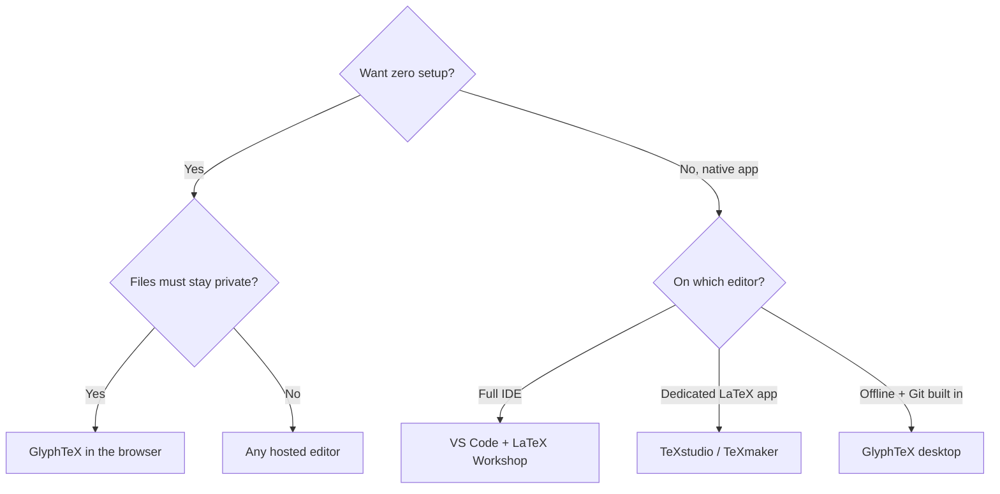

:::takeaways
- The right alternative depends on one question: do you want hosted convenience or local control?
- For no setup and full privacy, a browser engine (GlyphTeX) is the closest free match.
- For native desktop, TeXstudio, TeXmaker, and VS Code with LaTeX Workshop are proven.
- Typst is worth knowing, but it is a different language, not LaTeX.
:::

Overleaf is popular for good reasons, but it is not the only way to write LaTeX, and for many people it is not the best fit. Whether you care about privacy, offline access, cost, or just want a faster local toolchain, here are seven alternatives worth knowing, grouped by how they work.

## How to choose

## Browser-based, no install

### 1. GlyphTeX

Compiles LaTeX in the browser tab with a [WebAssembly engine](/engine). No account, no upload, files stay in the browser. Free and open source. The desktop app adds full offline use and built-in Git.

- **Best for:** zero setup with real privacy.
- **Trade-off:** no live co-editing.

::cta{title="See it work" body="Open a document and compile it in the browser. Nothing installs, nothing uploads." label="Open the workspace" href="/workspace" from="overleaf-alternatives"}

### 2. Papeeria and other hosted editors

Several services mirror Overleaf's hosted model with their own pricing and collaboration features. They keep the convenience and, with it, the trade-off: your files compile on their servers.

- **Best for:** teams that want hosted collaboration but different pricing.
- **Trade-off:** same privacy and offline limits as any hosted editor.

## Desktop editors (offline, install a TeX distribution)

These need [TeX Live or MiKTeX](/docs/getting-started/first-document) installed once, then run fully offline.

### 3. TeXstudio

A mature, dedicated LaTeX editor with an integrated PDF viewer, live preview, and strong autocomplete. Cross-platform and free.

- **Best for:** people who want a purpose-built LaTeX IDE.

### 4. TeXmaker

Similar in spirit to TeXstudio, clean and stable, with a built-in viewer and structure browser.

- **Best for:** a lighter dedicated editor.

### 5. VS Code with LaTeX Workshop

If you already live in VS Code, the LaTeX Workshop extension adds build-on-save, SyncTeX, and a preview pane. You get the whole editor ecosystem around your writing.

- **Best for:** developers who want one editor for code and papers.

### 6. GlyphTeX desktop

The native side of GlyphTeX: projects are plain folders, compiling uses a bundled engine or your system TeX, and Git is built in for versioned, selection-based commits.

- **Best for:** offline work with version history, without wiring up Git yourself.

## A different language worth knowing

### 7. Typst

Typst is not LaTeX. It is a newer typesetting language with a gentler syntax and fast compiles. If you are starting fresh and not tied to LaTeX packages or a journal template that demands LaTeX, it is worth a look. If you already have LaTeX documents or must submit LaTeX, it does not help you here.

- **Best for:** new projects with no LaTeX requirement.
- **Trade-off:** not compatible with existing LaTeX source.

## Quick comparison

| Tool | Runs | Offline | Account | Price |
| --- | --- | --- | --- | --- |
| GlyphTeX (browser) | In the tab | Yes | No | Free |
| GlyphTeX (desktop) | Native | Yes | No | Free |
| TeXstudio | Native | Yes | No | Free |
| TeXmaker | Native | Yes | No | Free |
| VS Code + Workshop | Native | Yes | No | Free |
| Hosted editors | Server | No | Yes | Free tier, then paid |
| Typst | Native or hosted | Varies | Varies | Free core |

:::callout{type=tip title="Rule of thumb"}
If setup effort is your blocker, start in the browser. If offline work and version history matter most, pick a desktop editor. If you need live co-editing above all, a hosted editor still wins.
:::

## The bottom line

There is no single best Overleaf alternative, only the one that matches how you work. For most people who want to leave hosted compilation without a heavy install, a browser engine is the smoothest exit, and a desktop editor is the natural next step when you want everything offline.

Next: [GlyphTeX vs Overleaf](/blog/glyphtex-vs-overleaf) for the head-to-head, or [Is Overleaf free?](/blog/is-overleaf-free) if pricing is what pushed you here.
