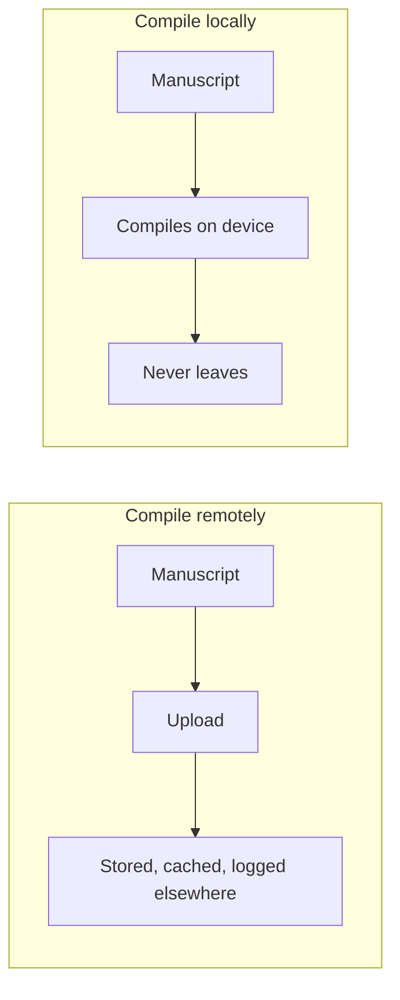

:::takeaways
- Compiling remotely uploads your unpublished work to a third party. That is a choice, not a requirement.
- Local compilation is more available: no server outage, no plan expiry, no network dependency.
- You control the toolchain, so a compile from today still works in five years.
- WebAssembly removed the old excuse: local no longer means a heavy install.
:::

I build local-first writing tools, so treat this as a stated bias. The argument still stands on its own: for most academic writing, the manuscript should compile where you are, not on a server you rent. Here is why, as an engineer rather than a marketer.

## Your unpublished work is the asset

A paper under review, a thesis under embargo, an industry report with results not yet public: these are the documents where exposure has a real cost. Every hosted compile uploads that source to infrastructure you do not control, to be stored, cached, logged, and governed by someone else's policy and someone else's jurisdiction.

Most of the time nothing goes wrong. Security is about the times something does. The cleanest way to not leak a manuscript is to never send it anywhere.

## Availability is a feature

A local compile has fewer things that can fail. It does not need a server to be up, a subscription to be current, or a network to exist. The deadline does not care that a service had an outage or that your trial expired at midnight.

:::callout{type=note title="The failure modes you remove"}
Server down, plan lapsed, region blocked, rate limited, queue backed up, wifi absent. A local compile is immune to all six.
:::

## You should own your toolchain

A hosted editor can change its compiler, its package versions, or its pricing, and your document changes with it. When the toolchain is yours, and pinned, a document that compiled today compiles the same way in five years. For work you may need to reproduce, revise, or defend, that reproducibility is not a nicety. It is the point.

This is why GlyphTeX pins its engine version and lets the desktop app use a fixed local TeX. The build is a known quantity, not a moving target.

## The old objection is gone

The historical reason to compile remotely was setup. A full TeX distribution is 4 to 7 GB and a maintenance chore. Hosted editors won by removing that friction.

WebAssembly removed it a different way. GlyphTeX compiles the [Tectonic engine in the browser](/engine): no multi-gigabyte install, packages fetched on demand, and it still runs on your device. You get the convenience that made hosted editors popular without giving up the source.

::stats{items="0 :: Bytes your manuscript travels | 0 :: Accounts | Pinned :: Engine version" source="GlyphTeX local-first architecture."}

## This is not anti-cloud

The cloud is right for plenty of things. Shared datasets, CI, backups, and live collaboration are genuine strengths. The claim is narrower: the default place to compile a private manuscript should be your own machine, and the network should be a choice you make, not a dependency you inherit.

::cta{title="Keep your next draft on your machine" body="Compile LaTeX in the browser with nothing uploaded, or install the desktop app for full offline work." label="Open the workspace" href="/workspace" from="why-local-first-latex"}

## Further reading

- The practical how-to: [How to write LaTeX without Overleaf](/blog/latex-without-overleaf).
- The mechanism: [the GlyphTeX engine](/engine).
- The privacy specifics: [what GlyphTeX does and does not collect](/privacy).
