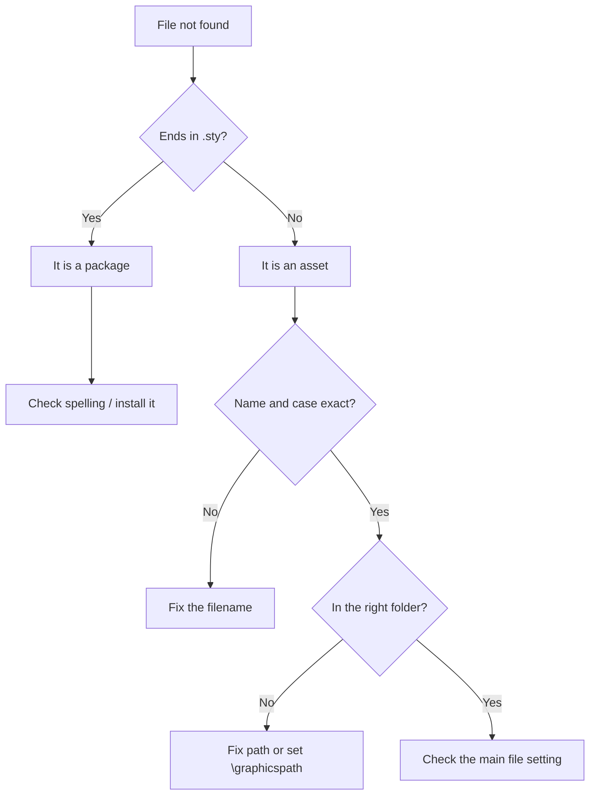

:::takeaways
- The error means LaTeX cannot find an image, an `\input` file, or a package.
- Cause 1: wrong name, extension, or capitalisation.
- Cause 2: the file is in a different folder from the main file.
- Cause 3: the package genuinely is not available.
- Paths are resolved relative to the main file, not the file doing the include.
:::

## The error, two forms

```text
! LaTeX Error: File `figure.png' not found.
```

```text
! LaTeX Error: File `siunitx.sty' not found.
```

The first is a missing **asset** (image or included file). The second is a missing **package** (`.sty`). The fixes differ.

## Missing image or input file

### Cause 1: name, extension, or case

```latex
\includegraphics{Figure.PNG}    % file is actually figure.png
\includegraphics{figure.png}    % right
```

**Fix:** match the filename exactly, including the extension and capitalisation. On case-sensitive systems, `Figure.png` and `figure.png` are different files.

### Cause 2: wrong folder

Paths resolve relative to the **main file**. If your images live in a `figures/` subfolder:

```latex
\includegraphics{figures/plot.pdf}
```

Or set a search path once in the preamble:

```latex
\usepackage{graphicx}
\graphicspath{{figures/}}
...
\includegraphics{plot.pdf}   % found in figures/
```

:::callout{type=note title="Set the main file"}
If the compiler is looking from the wrong place, the main file may be wrong. In GlyphTeX, set the main file so relative paths resolve from the right root.
:::

### Cause 3: unsupported image format

Modern engines handle `.pdf`, `.png`, and `.jpg`. Avoid `.eps` unless your workflow supports it, and never rely on `.bmp` or `.tiff`.

**Fix:** convert to PDF (for vector) or PNG (for raster).

## Missing package (.sty not found)

The package that provides a command is not installed or not available.

```latex
\usepackage{siunitx}   % File `siunitx.sty' not found
```

**Fix:**

- In the **GlyphTeX browser engine**, packages fetch on demand; a genuinely unavailable package name is usually a typo. Check the spelling.
- In a **local TeX install**, install the package through your distribution's package manager (TeX Live's `tlmgr`, or MiKTeX's package manager), or enable on-the-fly installation.

## One decision tree



## Related

- [Undefined control sequence](/docs/fixing-errors/undefined-control-sequence) (often a missing package)
- [Compile your first document](/docs/getting-started/first-document)
