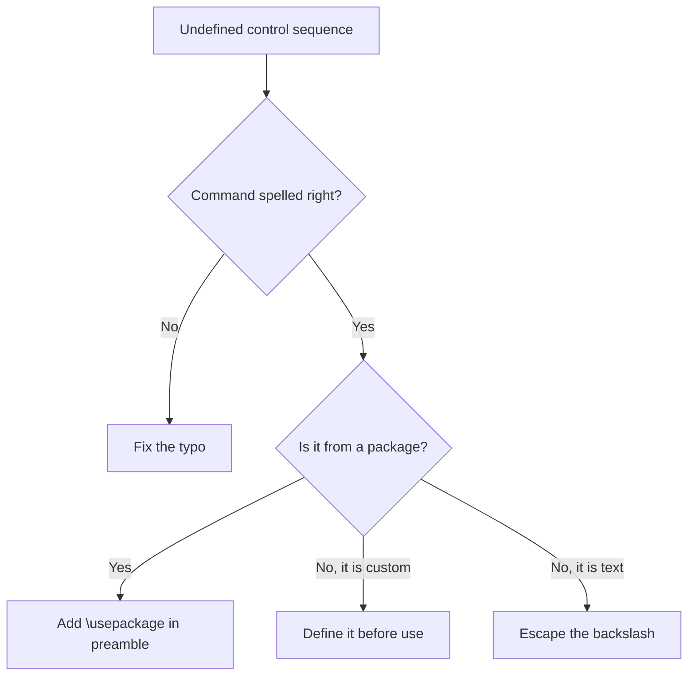

:::takeaways
- The error means LaTeX met a backslash command it does not know.
- Cause 1: a typo in the command name.
- Cause 2: the package that defines the command is not loaded.
- Cause 3: a custom command used before it is defined.
- Cause 4: a stray backslash in ordinary text.
:::

## The error

```text
! Undefined control sequence.
l.42 \includegraphics
                     {figure.png}
```

A "control sequence" is a command: a backslash followed by a name, like `\section` or `\textbf`. This error means LaTeX reached one it does not recognise. The line number (`l.42`) points at the offending command.

## Cause 1: a typo

The command name is misspelled.

```latex
\textbG{bold}     % wrong
\textbf{bold}     % right
```

**Fix:** check the spelling against the command you meant. Case matters: `\LaTeX` is not `\latex`.

## Cause 2: the package is not loaded

The command is real, but the package that defines it was never loaded.

```latex
% \includegraphics needs the graphicx package
\usepackage{graphicx}   % add this to the preamble
...
\includegraphics{figure.png}
```

**Fix:** add the matching `\usepackage{...}` in the preamble. Common pairings:

| Command | Needs package |
| --- | --- |
| `\includegraphics` | `graphicx` |
| `\href`, `\url` | `hyperref` |
| `\text`, `\dfrac` | `amsmath` |
| `\SI`, `\num` | `siunitx` |
| `\toprule`, `\midrule` | `booktabs` |

:::callout{type=tip title="Package fetch"}
In the GlyphTeX browser engine, adding `\usepackage` fetches the package on the next compile automatically. There is nothing to install by hand.
:::

## Cause 3: a custom command used too early

You defined a command, but used it before the definition, or forgot the definition.

```latex
\newcommand{\R}{\mathbb{R}}   % define first
...
$x \in \R$                    % then use
```

**Fix:** define custom commands in the preamble, before `\begin{document}`.

## Cause 4: a stray backslash

A backslash in normal text starts a command. An accidental one triggers the error.

```latex
The file is in C:\Users\me   % each backslash starts a "command"
```

**Fix:** for a literal backslash, use `\textbackslash`. For file paths in prose, prefer forward slashes or wrap them in `\texttt{...}`.

## How to locate it fast



## Still stuck

- Read the **first** such error, not the last; one missing package can cause many.
- Related: [Missing \$ inserted](/docs/fixing-errors/missing-dollar-inserted) and [File not found](/docs/fixing-errors/file-not-found).
