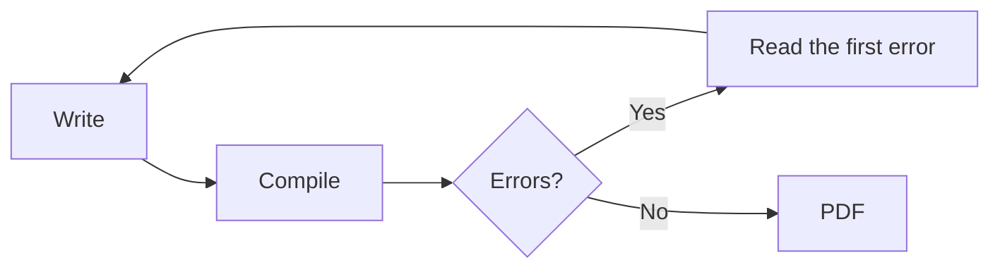

:::takeaways
- A LaTeX document needs a class, a `\begin{document}`, and a matching `\end{document}`.
- The preamble (before `\begin{document}`) loads packages and sets options.
- Compile, read the first error if any, fix it, compile again.
- In GlyphTeX this all happens in the browser, with no install.
:::

This is the shortest path from nothing to a compiled PDF. If you have never written LaTeX, start here.

## The smallest document that works

```latex
\documentclass{article}
\begin{document}
Hello, LaTeX.
\end{document}
```

Three lines matter:

- `\documentclass{article}` picks the document type. `article` suits papers and short reports; `report` and `book` add chapters.
- `\begin{document}` marks where content starts.
- `\end{document}` marks where it ends. Anything after it is ignored.

Paste this into the [workspace](/workspace) and compile. You get a one-line PDF.

## Adding a title and structure

```latex
\documentclass{article}
\title{A short report}
\author{Your name}
\date{\today}

\begin{document}
\maketitle

\section{Introduction}
This is the first section.

\section{Method}
This is the second.
\end{document}
```

- The lines between `\documentclass` and `\begin{document}` are the **preamble**. Titles, packages, and settings go here.
- `\maketitle` prints the title block. Without it, the title does not appear.
- `\section{...}` creates numbered headings automatically.

## Loading a package

Packages add features. Load them in the preamble with `\usepackage`:

```latex
\documentclass{article}
\usepackage{graphicx}   % include images
\usepackage{amsmath}    % better maths
\begin{document}
\end{document}
```

:::callout{type=note title="Packages fetch on demand"}
In the GlyphTeX browser engine, a package downloads the first time a document uses it, then caches. You do not install a full distribution up front.
:::

## The compile loop



LaTeX is a compiler, so expect to compile, read, and fix in a loop. This is normal, not a sign anything is wrong.

## When the first error appears

Two rules save the most time:

1. **Read the first error, not the last.** One early mistake often triggers a cascade of later ones. Fix the first and the rest usually vanish.
2. **The line number is a hint, not gospel.** The real cause is often on the line above, especially a missing brace or a missing `\end`.

The three you will meet earliest each have a fix here:

- [Undefined control sequence](/docs/fixing-errors/undefined-control-sequence)
- [Missing \$ inserted](/docs/fixing-errors/missing-dollar-inserted)
- [File not found](/docs/fixing-errors/file-not-found)

## Next steps

- Writing something long? [Structure a thesis or dissertation](/docs/writing/thesis-structure).
- Adding references? [Bibliographies with BibTeX and biblatex](/docs/writing/bibliographies).
