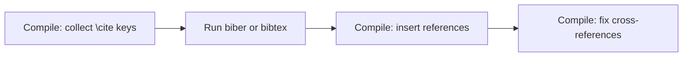

:::takeaways
- Store references in a `.bib` file, one entry per source.
- Cite with `\cite{key}` (BibTeX) or `\autocite{key}` (biblatex).
- biblatex + biber is the modern default; classic BibTeX still works.
- References need multiple passes: build, bibliography tool, build, build.
:::

Citations in LaTeX come from a separate database file, so you write each reference once and cite it anywhere. Two systems do this: classic **BibTeX** and the newer **biblatex**.

## The .bib file

Both systems read a `.bib` file of entries. Each entry has a type, a key you cite by, and fields.

```bibtex
@article{shannon1948,
  author  = {Shannon, C. E.},
  title   = {A Mathematical Theory of Communication},
  journal = {Bell System Technical Journal},
  year    = {1948},
  volume  = {27},
  pages   = {379--423}
}

@book{knuth1984,
  author    = {Knuth, Donald E.},
  title     = {The {\TeX}book},
  publisher = {Addison-Wesley},
  year      = {1984}
}
```

The key (`shannon1948`) is what you cite. Choose keys you will recognise.

## Option A: biblatex (recommended)

Load biblatex in the preamble and name your `.bib` file:

```latex
\usepackage[backend=biber, style=authoryear]{biblatex}
\addbibresource{references.bib}
```

Cite in the text, and print the list where you want it:

```latex
Information theory began with \autocite{shannon1948}.

\printbibliography
```

Change `style=` to switch the whole look: `numeric`, `authoryear`, `ieee`, and many more, with no change to your text.

## Option B: classic BibTeX

Load a style and point to the `.bib` file (without extension):

```latex
\bibliographystyle{plainnat}   % needs \usepackage{natbib}
...
As shown by \cite{shannon1948}.
...
\bibliography{references}
```

:::callout{type=note title="Which to choose"}
Start new documents with biblatex and biber. Reach for classic BibTeX only when a journal or class file requires it.
:::

## The compile sequence

This is the step people miss. A bibliography needs more than one pass, because the first pass only records which keys were cited.



- **biblatex:** compile, run **biber**, compile, compile.
- **classic BibTeX:** compile, run **bibtex**, compile, compile.

:::callout{type=tip title="GlyphTeX runs the passes for you"}
The GlyphTeX engine detects that a bibliography is present and runs the multi-pass sequence automatically, so `[?]` placeholders resolve without you sequencing the tools by hand.
:::

## Why citations show as [?]

If you see `[?]` or an empty reference list, the bibliography tool did not run or the passes ran out of order. Recompile through the full sequence above. With GlyphTeX this happens automatically; with a manual toolchain, run biber or bibtex between compiles.

## Related

- [Structure a thesis in LaTeX](/docs/writing/thesis-structure)
- [Fix: File not found](/docs/fixing-errors/file-not-found) (a missing `.bib` reports here)
