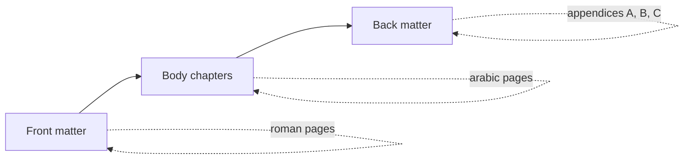

:::takeaways
- Keep a small main file; put each chapter in its own file and `\input` them.
- Use `report` or `book`, or your university's official class if it exists.
- Separate front matter, body, and back matter clearly.
- Compiling one chapter at a time keeps the edit loop fast.
:::

A thesis is the document most likely to become unmanageable as a single file. A little structure up front keeps it navigable to the last week.

## The file layout

```text
thesis/
  main.tex          <- setup only, no prose
  preamble.tex      <- packages and settings
  frontmatter/
    titlepage.tex
    abstract.tex
  chapters/
    01-introduction.tex
    02-method.tex
    03-results.tex
    04-conclusion.tex
  references.bib
  figures/
```

## The main file

The main file should contain almost no prose. It sets up the document and pulls in the parts.

```latex
\documentclass[12pt,a4paper]{report}
\input{preamble}

\begin{document}

\input{frontmatter/titlepage}
\input{frontmatter/abstract}
\tableofcontents

\input{chapters/01-introduction}
\input{chapters/02-method}
\input{chapters/03-results}
\input{chapters/04-conclusion}

\bibliographystyle{plainnat}
\bibliography{references}

\end{document}
```

Each `\input{...}` drops the named file in place at compile time. A chapter file is just its content, no preamble of its own:

```latex
% chapters/01-introduction.tex
\chapter{Introduction}
This chapter sets out the problem.
```

## The preamble file

Keep packages and settings in one place so the main file stays clean.

```latex
% preamble.tex
\usepackage[utf8]{inputenc}
\usepackage{graphicx}
\graphicspath{{figures/}}
\usepackage{amsmath}
\usepackage[numbers]{natbib}
\usepackage{hyperref}
```

## Front matter, body, back matter

`book` and `report` support a clean split:

- **Front matter:** title page, abstract, table of contents. In `book`, `\frontmatter` switches to roman page numbers.
- **Body:** the chapters. `\mainmatter` in `book` resets to arabic numbering.
- **Back matter:** bibliography and appendices. `\appendix` switches chapter numbering to letters.



## Compile one chapter while drafting

Rebuilding a 200-page document to check one paragraph is slow. The `\includeonly` command limits the build to named files while keeping cross-references intact:

```latex
% in the preamble, while drafting chapter 3
\includeonly{chapters/03-results}
```

Use `\include` (not `\input`) for chapters you want `\includeonly` to control. `\include` starts a new page; `\input` does not.

:::callout{type=tip title="Keep the fast loop"}
Draft with `\includeonly` set to the current chapter, then remove it for the final full compile. In GlyphTeX the compile is local, so even the full build has no server queue.
:::

## University templates

If your institution provides an official class or template, use it. It usually encodes required margins, the title-page format, and declaration pages, which saves you from reproducing rules by hand and from a rejected submission.

## Next

- Add citations: [Bibliographies with BibTeX and biblatex](/docs/writing/bibliographies).
- Hitting compile limits elsewhere? [Why compile locally](/blog/why-local-first-latex).
